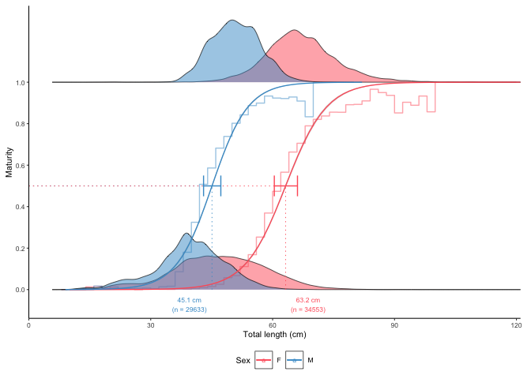
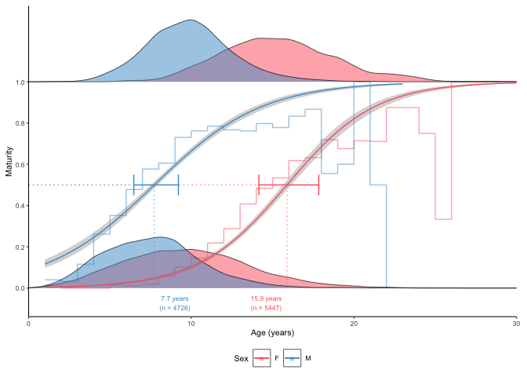
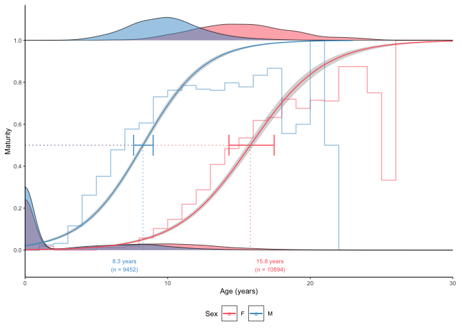
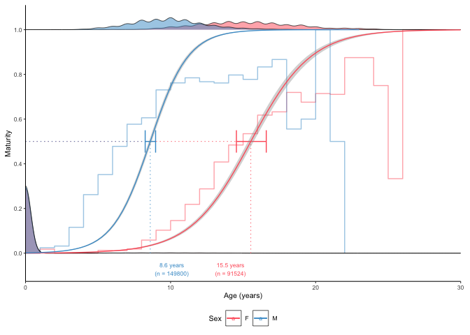

# ggFishPlots

**Visualise and calculate life history parameters for fisheries science
using ggplot2. R package version 0.1.7**

<!-- badges: start -->

[](https://github.com/DeepWaterIMR/ggFishPlots/actions)
<!-- badges: end -->

## Overview

The ggFishPlots package for [R](https://www.r-project.org/) allows
quickly plotting and calculating life history parameters required by
stock assessment models. The package uses
[ggplot2](https://ggplot2.tidyverse.org/reference) for plotting and the
[tidyverse](https://www.tidyverse.org/) packages for calculations.

The ggOceanMaps package has been developed by the [Institute of Marine
Research](https://www.hi.no/en). Note that the package comes with
absolutely no warranty. Any [bug reports and code
fixes](https://github.com/DeepWaterIMR/ggFishPlots/issues) are warmly
welcomed. See [*Contributions*](#contributions) for further details.

If you are looking for other similar packages, make sure to check out
[AquaticLifeHistory](https://jonathansmart.github.io/AquaticLifeHistory/articles/Maturity_analyses.html).

## Installation

The package is currently available only on
[GitHub](https://github.com/DeepWaterIMR/ggFishPlots). It can be
installed directly using the
[**devtools**](https://cran.r-project.org/web/packages/devtools/index.html)
or remotes packages.

``` r
devtools::install_github("DeepWaterIMR/ggFishPlots")
```

## Usage

At the time of writing, the package produces three kinds of plots:
growth curves, maturity plots, and length-weight relationships. Each
function returns a ggplot2 plot and the estimated parameters as a text
string that can be used in Rmarkdown and Shiny applications as well as a
data frame for further use of the parameters. The elements are returned
as a list. The package contains example data to illustrate the
functionality.

### Growth curves

Simple plot. Note how the `text` and `params` are returned as a list
together with `plot`.

``` r
library(ggFishPlots)

data(survey_ghl) # example data

head(survey_ghl)
#> # A tibble: 6 × 5
#>     age sex   length weight maturity
#>   <dbl> <chr>  <dbl>  <dbl>    <int>
#> 1    NA <NA>      35     NA        0
#> 2    NA <NA>      43     NA        0
#> 3    NA <NA>      51     NA        0
#> 4    NA <NA>      31     NA        0
#> 5    NA <NA>      32     NA        0
#> 6    NA <NA>      32     NA        0

plot_growth(survey_ghl, length = "length", age = "age")
#> $plot
```

<!-- -->

    #> 
    #> $text
    #> [1] "von Bertalanffy growth function coefficients:  \n Linf (asymptotic average length) = 91.2 cm +/- 88.3 - 94.6 (95% CIs)  \n K (growth rate coefficient) = 0.0633 +/- 0.059 - 0.068 (95% CIs)  \n t0 (age at length 0) = -3.04 (years) +/- -3.3 - -2.8 (95% CIs)  \n tmax (life span; t0 + 3/K) = 44.4 years  \n Number of included specimens = 10401  \n Total number of measured = 618779  \n Excluded (length or age missing):  \n Length = 0; age = 608378"
    #> 
    #> $params
    #> # A tibble: 3 × 7
    #>   term  estimate std.error statistic   p.value conf.low conf.high
    #>   <chr>    <dbl>     <dbl>     <dbl>     <dbl>    <dbl>     <dbl>
    #> 1 Sinf   91.2      1.51         60.3 0          88.3      94.6   
    #> 2 K       0.0633   0.00231      27.4 4.90e-160   0.0586    0.0680
    #> 3 t0     -3.04     0.139       -21.8 1.71e-103  -3.34     -2.77

Split by sex. Specifying `length`, `age` and `sex` arguments have been
omitted since they are the argument names by default and the same than
in the example data. Only the `plot` element is returned this time.

``` r
plot_growth(survey_ghl, split.by.sex = TRUE)$plot
```

<!-- -->

The dashed lines are
.
Data behind the growth curves are shown as box plots by default. It is
possible to plot the data as points by defining `boxplot = FALSE`. We
can also force zero group into the curves if know the length of it.
Assumed as 10 cm here:

``` r
plot_growth(survey_ghl, force.zero.group.length = 10, boxplot = FALSE)$plot
```

<!-- -->

### Maturity plots

Simple L50 plot:

``` r
plot_maturity(survey_ghl, length = "length", maturity = "maturity")
#> $plot
```

<!-- -->

    #> 
    #> $text
    #> [1] "50% maturity at length (L50) based on logit regressions:\n54.781 cm. 95% confidence intervals: 52.848 - 56.787\n  Number of specimens: 64186"
    #> 
    #> $params
    #>       mean   ci.min  ci.max     n
    #> 1 54.78111 52.84785 56.7868 64186

The error bars represent 95% confidence intervals calculated from the
model object using the
[`confint()`](https://stat.ethz.ch/R-manual/R-devel/library/MASS/html/confint.html)
function and back-transformed to the original scale. The grey stepped
line is a binned average defined using the `length.bin.width` argument.

Split by sex:

``` r
plot_maturity(survey_ghl, split.by.sex = TRUE)$plot
```

<!-- -->

The same principle can be used to produce A50 (50% maturity at age)
plots:

``` r
plot_maturity(survey_ghl, length = "age", length.unit = "years",
              xlab = "Age", length.bin.width = 1, split.by.sex = TRUE)$plot
```

<!-- -->

### Length-weight relationships

Simple plot using log-transformation and linear models by default:

``` r
plot_lw(survey_ghl, length = "length", weight = "weight")
#> $plot
```

<!-- -->

    #> 
    #> $text
    #> [1] "Logarithm transformed linear length-weight model. Not splitted by sex:  \n a = 0 +/- 0 - 0 (95% CIs).  \n b = 3.221 +/- 3.22 - 3.22 (95% CIs).  \n Number of included specimens = 67457  \n Total number of measured = 618779  \n Excluded (data missing): \n Length = 0; weight = 551322"
    #> 
    #> $params
    #> # A tibble: 2 × 7
    #>   term    estimate std.error statistic p.value   conf.low  conf.high
    #>   <chr>      <dbl>     <dbl>     <dbl>   <dbl>      <dbl>      <dbl>
    #> 1 a     0.00000382   0.00491    -2540.       0 0.00000379 0.00000386
    #> 2 b     3.22         0.00128     2519.       0 3.22       3.22

The dashed lines represent 95% confidence intervals. Use non-linear
least squares instead:

``` r
plot_lw(survey_ghl, use.nls = TRUE)
#> $plot
```

<!-- -->

    #> 
    #> $text
    #> [1] "Nonlinear least squares length-weight model. Not splitted by sex:  \n a = 0 +/- 0 - 0 (95% CIs).  \n b = 3.419 +/- 3.42 - 3.42 (95% CIs).  \n Number of included specimens = 67457  \n Total number of measured = 618779  \n Excluded (data missing): \n Length = 0; weight = 551322"
    #> 
    #> $params
    #> # A tibble: 2 × 7
    #>   term    estimate    std.error statistic p.value   conf.low  conf.high
    #>   <chr>      <dbl>        <dbl>     <dbl>   <dbl>      <dbl>      <dbl>
    #> 1 a     0.00000173 0.0000000156      110.       0 0.00000170 0.00000176
    #> 2 b     3.42       0.00215          1590.       0 3.42       3.42

Split by sex:

``` r
plot_lw(survey_ghl, split.by.sex = TRUE)$plot
```

<!-- -->

Log-log axes to see differences:

``` r
plot_lw(survey_ghl, split.by.sex = TRUE, log.axes = TRUE)$plot
```

<!-- -->

Note that the floating point in the parameters depends on the [length
and weight
units](https://www.fishbase.de/manual/fishbasethe_length_weight_table.htm).
According to the FishBase, one should use centimeters and grams but you
can also transform the parameters according to the formulas given in the
FishBase too.

``` r
plot_lw(survey_ghl %>% dplyr::mutate(weight = weight*1000), weight.unit = "g")$params
#> # A tibble: 2 × 7
#>   term  estimate std.error statistic p.value conf.low conf.high
#>   <chr>    <dbl>     <dbl>     <dbl>   <dbl>    <dbl>     <dbl>
#> 1 a      0.00382   0.00491    -1133.       0  0.00379   0.00386
#> 2 b      3.22      0.00128     2519.       0  3.22      3.22
```

## Citations and data sources

The data used in the package are a property of the Institute of Marine
Research and the Norwegian Government. They are distributed under the
Creative Commons ([CCBY](https://creativecommons.org/licenses/by/4.0/)
or [NLOD](https://data.norge.no/nlod/no/1.0/)) licenses allowing free
use as long as the source (IMR) is cited. We ask any user to refer to
the package if plots or estimates are used in reports or scientific
articles. For up-to-date citation information, please use:

``` r
citation("ggFishPlots")
#> 
#> To cite package 'ggFishPlots' in publications use:
#> 
#>   Mikko Vihtakari (2022). ggFishPlots: Visualise and calculate life
#>   history parameters for fisheries science using 'ggplot2'. R package
#>   version 0.1.7. https://github.com/DeepWaterIMR/ggFishPlots
#> 
#> A BibTeX entry for LaTeX users is
#> 
#>   @Manual{,
#>     title = {ggFishPlots: Visualise and calculate life history parameters for fisheries science using 'ggplot2'},
#>     author = {Mikko Vihtakari},
#>     year = {2022},
#>     note = {R package version 0.1.7},
#>     url = {https://github.com/DeepWaterIMR/ggFishPlots},
#>   }
```

## Contributions

Any contributions to the package are more than welcome. Please contact
the package maintainer Mikko Vihtakari (<mikko.vihtakari@hi.no>) to
discuss your ideas on improving the package. Bug reports and corrections
should be submitted directly to [the GitHub
site](https://github.com/DeepWaterIMR/ggFishPlots/issues). Please
include a [minimal reproducible
example](https://en.wikipedia.org/wiki/Minimal_working_example).
Considerable contributions to the package development will be credited
with an authorship.
