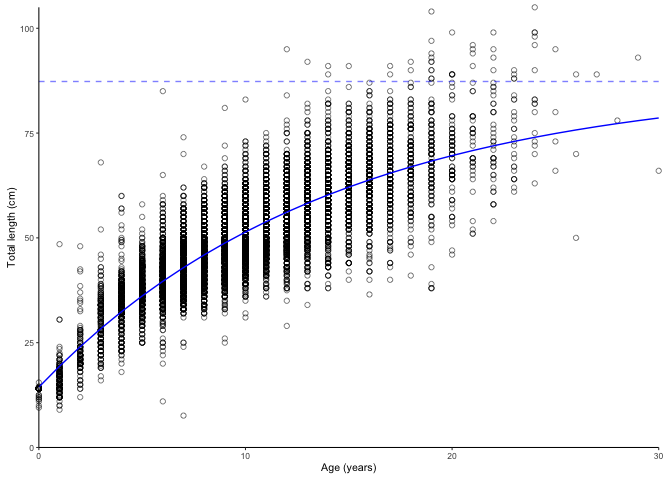
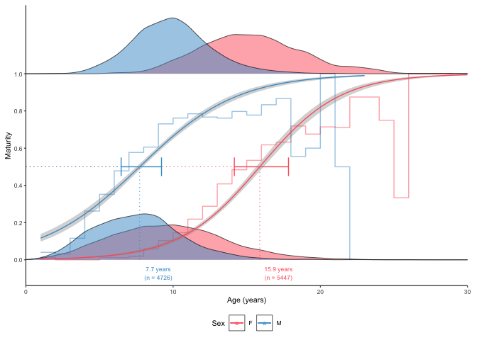
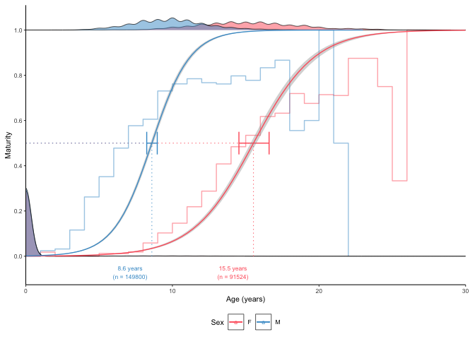
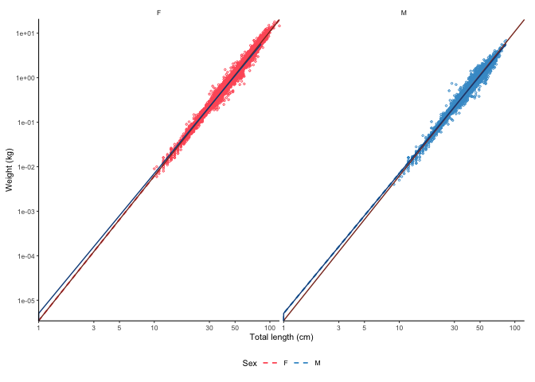
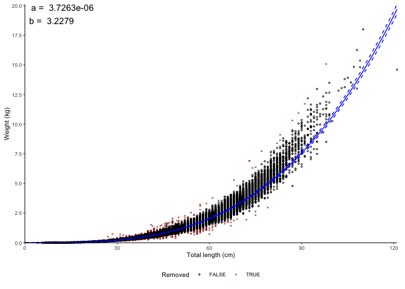

# ggFishPlots

**Visualise and calculate life history parameters for fisheries science
using ggplot2. R package version 0.4.1**

## Overview

The [ggFishPlots](https://deepwaterimr.github.io/ggFishPlots/) package
for [R](https://www.r-project.org/) allows quickly plotting and
calculating life history parameters required by stock assessment models.
The package uses [ggplot2](https://ggplot2.tidyverse.org/reference) for
plotting and the [tidyverse](https://www.tidyverse.org/) packages for
calculations.

The ggOceanMaps package has been developed by the [Institute of Marine
Research](https://www.hi.no/en). Note that the package comes with
absolutely no warranty. Any [bug reports and code
fixes](https://github.com/DeepWaterIMR/ggFishPlots/issues) are warmly
welcomed. See [*Contributions*](#contributions) for further details.

If you are looking for other similar packages, make sure to check out
the
[AquaticLifeHistory](https://jonathansmart.github.io/AquaticLifeHistory/articles/Maturity_analyses.html),
[FSA](https://CRAN.R-project.org/package=FSA), and
[fishmethods](https://CRAN.R-project.org/package=fishmethods) packages,
as well as the [FishR
webpage](https://fishr-core-team.github.io/fishR/pages/packages.html).

## Installation

The most up to date version of the package can always be found from
[GitHub](https://github.com/DeepWaterIMR/ggFishPlots). If the [CRAN
version](https://CRAN.R-project.org/package=ggFishPlots) does not work
as shown in the examples on this website, try installing the GitHub
version. You can do this by using the
[devtools](https://cran.r-project.org/web/packages/devtools/index.html)
or [remotes](https://cran.r-project.org/web/packages/remotes/index.html)
packages.

``` r
remotes::install_github("DeepWaterIMR/ggFishPlots")
```

## Usage

The package has a
[website](https://deepwaterimr.github.io/ggFishPlots/). At the time of
writing, the package produces four kinds of plots: [growth
curves](#growth-curves), [maturity plots](#maturity-plots),
[length-weight relationships](#length-weight-relationships), and [catch
curves](#catch-curves-to-estimate-instantaneous-total-mortality-z). Each
function returns a ggplot2 plot and the estimated parameters as a text
string that can be used in Rmarkdown and Shiny applications as well as a
data frame for further use of the parameters. The elements are returned
as a list. The package contains example data to illustrate the
functionality.

### Growth curves

Note how the `text` and `params` are returned as a list together with
`plot`.

``` r
library(ggFishPlots)

data(survey_ghl) # example data

head(survey_ghl)
#> # A tibble: 6 × 5
#>     age sex   length weight maturity
#>   <dbl> <chr>  <dbl>  <dbl>    <int>
#> 1    NA <NA>      35     NA        0
#> 2    NA <NA>      43     NA        0
#> 3    NA <NA>      51     NA        0
#> 4    NA <NA>      31     NA        0
#> 5    NA <NA>      32     NA        0
#> 6    NA <NA>      32     NA        0

plot_growth(survey_ghl, length = "length", age = "age")
#> $plot
```


``` R
#> 
#> $text
#> [1] "von Bertalanffy growth function coefficients:  \n Linf (asymptotic average length) = 91.2 cm +/- 88.3 - 94.6 (95% CIs)  \n K (growth rate coefficient) = 0.0633 +/- 0.059 - 0.068 (95% CIs)  \n t0 (age at length 0) = -3.04 (years) +/- -3.337 - -2.769 (95% CIs)  \n tmax (life span; t0 + 3/K) = 44.4 years  \n Number of included specimens = 10401  \n Total number of measured = 618779  \n Excluded (length or age missing):  \n Length = 0; age = 608378"
#> 
#> $params
#> # A tibble: 3 × 7
#>   term  estimate std.error statistic   p.value conf.low conf.high
#>   <chr>    <dbl>     <dbl>     <dbl>     <dbl>    <dbl>     <dbl>
#> 1 Sinf   91.2      1.51         60.3 0          88.3      94.6   
#> 2 K       0.0633   0.00231      27.4 4.90e-160   0.0586    0.0680
#> 3 t0     -3.04     0.139       -21.8 1.71e-103  -3.34     -2.77  
#> 
#> $model
#> NULL
#> 
#> $data
#> NULL
```

The `text` object can be rendered to R markdown documents using the
`results = 'asis'` setting in the code chunk header
(i.e. `{r, results = 'asis'}`) and the
[`cat()`](https://rdrr.io/r/base/cat.html) function after replacing
`"\n"` by `"\ n"`:

``` r
htmlcat <- function(text){
  cat(gsub(pattern = "\n", replacement = "  \n", x = text))
}

htmlcat(plot_growth(survey_ghl)$text)
```

von Bertalanffy growth function coefficients:  
Linf (asymptotic average length) = 91.2 cm +/- 88.3 - 94.6 (95% CIs)  
K (growth rate coefficient) = 0.0633 +/- 0.059 - 0.068 (95% CIs)  
t0 (age at length 0) = -3.04 (years) +/- -3.337 - -2.769 (95% CIs)  
tmax (life span; t0 + 3/K) = 44.4 years  
Number of included specimens = 10401  
Total number of measured = 618779  
Excluded (length or age missing):  
Length = 0; age = 608378

#### Split by sex

Specifying `length`, `age` and `sex` arguments have been omitted since
they are the argument names by default and the same than in the example
data. Only the `plot` element is returned this time.

``` r
plot_growth(survey_ghl, split.by.sex = TRUE)$plot
```


The dashed lines are $`S_{inf}`$. Data behind the growth curves are
shown as box plots by default. It is possible to plot the data as points
by defining `boxplot = FALSE`. We can also force zero group into the
curves if know the length of it. Assumed as 14 cm here. Zero group
forcing strength is 10 % of number of observations by default and can be
adjusted using the `force.zero.group.strength` argument.

``` r
plot_growth(survey_ghl, force.zero.group.length = 14, boxplot = FALSE)$plot
```



### Maturity plots

#### L50 plots

Maturity ogives are estimated using a logistic
(`family = binomial(link = "logit")`)
[`glm()`](https://www.rdocumentation.org/packages/stats/versions/3.6.2/topics/glm)

``` r
plot_maturity(survey_ghl, length = "length", maturity = "maturity")
#> $plot
```


``` R
#> 
#> $text
#> [1] "50% maturity at length (L50) based on logit regressions:\n54.784 cm. 95% confidence intervals: 52.852 - 56.787\n  Number of specimens: 64265.\n Confidence intervals estimated from the glm object."
#> 
#> $params
#>       mean   ci.min ci.max  sex intercept     slope     n
#> 1 54.78361 52.85249 56.787 both -5.755492 0.1050587 64265
```

The error bars represent 95% confidence intervals calculated from the
model object using the
[`confint()`](https://stat.ethz.ch/R-manual/R-devel/library/MASS/html/confint.html)
function and back-transformed to the original scale. The grey stepped
line is a binned average defined using the `length.bin.width` argument.

The function also contains an option to bootstrap the confidence
intervals (CIs) which will produce narrower CIs. Bootstrapping is
probably a more correct way of estimating CIs in this application. Using
only 10 replicates here to save processing time. In real application use
at least 1000.

``` r
plot_maturity(survey_ghl, bootstrap.n = 10)
#> $plot
```


``` R
#> 
#> $text
#> [1] "50% maturity at length (L50) based on logit regressions:\n54.808 cm. 95% confidence intervals: 54.645 - 54.974\n  Number of specimens: 64265\n\n Confidence intervals estimated using 10 bootstrap replicates."
#> 
#> $params
#>       mean   ci.min   ci.max  sex intercept     slope     n
#> 1 54.80834 54.64512 54.97355 both -5.755492 0.1050587 64265
```

#### Split by sex

``` r
plot_maturity(survey_ghl, split.by.sex = TRUE)$plot
```


#### A50 plots

The same principle can be used to produce A50 (50% maturity at age)
plots:

``` r
plot_maturity(survey_ghl, length = "age", length.unit = "years",
              xlab = "Age", length.bin.width = 1, split.by.sex = TRUE)$plot
```



#### Addition of juveniles

Also the [`plot_maturity()`](reference/plot_maturity.md) function has
the option to add juveniles (zero group fish). The addition of juveniles
can be necessary for to make the
[`glm()`](https://rdrr.io/r/stats/glm.html) to converge if small
immature fish are scarce in the dataset.

``` r
plot_maturity(survey_ghl, length = "age", length.unit = "years",
              xlab = "Age", length.bin.width = 1, 
              force.zero.group.length = 0,
              force.zero.group.strength = 100,
              split.by.sex = TRUE)$plot
```


Note how the addition increases the estimate for males because the
dataset did not contain a sufficient number of young males which the
number of females seems sufficient because females mature older in this
species.

One option can be to estimate the number of added juveniles using the
[`plot_catchcurve()`](#catchcurvesep) function:

``` r
plot_maturity(survey_ghl, length = "age", length.unit = "years",
              xlab = "Age", length.bin.width = 1, 
              force.zero.group.length = 0,
              force.zero.group.n = c("F" = exp(11.363), "M" = exp(11.885)),
              split.by.sex = TRUE)$plot
```



### Length-weight relationships

#### Log-linearized models

Simple plot using log-transformation and linear models by default.

``` r
plot_lw(survey_ghl, length = "length", weight = "weight")
#> $plot
```


``` R
#> 
#> $text
#> [1] "Logarithm transformed linear length-weight model. Not splitted by sex:  \n a = 3.8236e-06 +/- 3.7869e-06 - 3.8606e-06 (95% CIs).  \n b = 3.221 +/- 3.22 - 3.22 (95% CIs).  \n Length in cm and weight in kg  \n Number of included specimens = 67457  \n Total number of measured = 618779  \n Excluded (data missing): \n Length = 0; weight = 551322; outlier = 0"
#> 
#> $params
#> # A tibble: 2 × 14
#>   term    estimate std.error statistic p.value   conf.low  conf.high r.squared
#>   <chr>      <dbl>     <dbl>     <dbl>   <dbl>      <dbl>      <dbl>     <dbl>
#> 1 a     0.00000382   0.00491    -2540.       0 0.00000379 0.00000386     0.989
#> 2 b     3.22         0.00128     2519.       0 3.22       3.22           0.989
#> # ℹ 6 more variables: AIC <dbl>, nobs <int>, length <chr>, length.unit <chr>,
#> #   weight <chr>, weight.unit <chr>
```

The dashed lines represent 95% confidence intervals.

#### Non-linear least square models

Use non-linear least squares instead:

``` r
plot_lw(survey_ghl, use.nls = TRUE)
#> $plot
```


``` R
#> 
#> $text
#> [1] "Nonlinear least squares length-weight model. Not splitted by sex:  \n a = 1.7268e-06 +/- 1.6962e-06 - 1.758e-06 (95% CIs).  \n b = 3.419 +/- 3.42 - 3.42 (95% CIs).  \n Length in cm and weight in kg  \n Number of included specimens = 67457  \n Total number of measured = 618779  \n Excluded (data missing): \n Length = 0; weight = 551322; outlier = 0"
#> 
#> $params
#> # A tibble: 2 × 13
#>   term    estimate  std.error statistic p.value conf.low conf.high     AIC  nobs
#>   <chr>      <dbl>      <dbl>     <dbl>   <dbl>    <dbl>     <dbl>   <dbl> <int>
#> 1 a     0.00000173    1.56e-8      110.       0  1.70e-6   1.76e-6 -27925. 67457
#> 2 b     3.42          2.15e-3     1590.       0  3.42e+0   3.42e+0 -27925. 67457
#> # ℹ 4 more variables: length <chr>, length.unit <chr>, weight <chr>,
#> #   weight.unit <chr>
```

#### Split by sex

The decimal point of a and b estimates depends on the length and weight
units.
[FishBase](https://www.fishbase.se/manual/english/FishBaseThe_LENGTH_WEIGHT_Table.htm)
uses centimeters and grams. The function can correct for the units when
asked (but `length.unit` and `weight.unit` parameters have to be defined
correctly).

``` r
plot_lw(survey_ghl, split.by.sex = TRUE, correct.units = TRUE)
#> $plot
```


``` R
#> 
#> $text
#> [1] "Logarithm transformed linear length-weight model for females and males, respectively:  \n a = 0.0035 +/- 0.00344 - 0.00355 (95% CIs) and 0.00507 +/- 0.00497 - 0.00517 (95% CIs).  \n b = 3.247 +/- 3.24 - 3.25 (95% CIs) and 3.143 +/- 3.14 - 3.15 (95% CIs).  \n Length in cm and weight in g  \n Number of included specimens = 34889 and 30354  \n Total number of measured = 618779  \n Excluded (data missing): \n Length = 0; weight = 456891; sex = 96645; outlier = 0"
#> 
#> $params
#> # A tibble: 4 × 15
#> # Groups:   sex [2]
#>   sex   term  estimate std.error statistic p.value conf.low conf.high r.squared
#>   <chr> <chr>    <dbl>     <dbl>     <dbl>   <dbl>    <dbl>     <dbl>     <dbl>
#> 1 F     a      0.00350   0.00765     -739.       0  0.00344   0.00355     0.988
#> 2 F     b      3.25      0.00195     1666.       0  3.24      3.25        0.988
#> 3 M     a      0.00507   0.0101      -525.       0  0.00497   0.00517     0.979
#> 4 M     b      3.14      0.00265     1188.       0  3.14      3.15        0.979
#> # ℹ 6 more variables: AIC <dbl>, nobs <int>, length <chr>, length.unit <chr>,
#> #   weight <chr>, weight.unit <chr>
```

You can also transform the parameters according to the formulas given in
the FishBase.

``` r
plot_lw(survey_ghl %>% dplyr::mutate(weight = weight*1000), weight.unit = "g")$params
#> # A tibble: 2 × 14
#>   term  estimate std.error statistic p.value conf.low conf.high r.squared
#>   <chr>    <dbl>     <dbl>     <dbl>   <dbl>    <dbl>     <dbl>     <dbl>
#> 1 a      0.00382   0.00491    -1133.       0  0.00379   0.00386     0.989
#> 2 b      3.22      0.00128     2519.       0  3.22      3.22        0.989
#> # ℹ 6 more variables: AIC <dbl>, nobs <int>, length <chr>, length.unit <chr>,
#> #   weight <chr>, weight.unit <chr>
```

#### Log-log axes to see differences

``` r
plot_lw(survey_ghl, split.by.sex = TRUE, log.axes = TRUE)$plot
```



#### Outlier removal

``` r
plot_lw(survey_ghl, outlier.percentile = 99.5, annotate.coefficients = TRUE)$plot
```



### Catch curves to estimate instantaneous total mortality (Z)

Catch curves were added to the version 0.2.3 and may not be available in
the CRAN version. [A FishR tutorial written by Ogle
(2013)](https://www.fishbase.se/manual/english/FishBaseThe_LENGTH_WEIGHT_Table.htm)
contains a nice explanation of catch curves. At the time of writing
ggFishPlots calculates only the simple log-linearised regression.

``` r
plot_catchcurve(survey_ghl)
#> $plot
```


``` R
#> 
#> $text
#> [1] "Instantenous total mortality (Z) estimated using a catch curve and\nage range .\n\nZ = 0.19 (0.123-0.257 95% CIs)\nN at age 0 = 1448 (449-4674 95% CIs)\nLongevity = 38.3 years (23.8 - 68.8 95% CIs)\n\n"
#> 
#> $params
#> # A tibble: 2 × 8
#>   sex   term        estimate std.error statistic  p.value conf.low conf.high
#>   <chr> <chr>          <dbl>     <dbl>     <dbl>    <dbl>    <dbl>     <dbl>
#> 1 both  (Intercept)    7.28     0.573      12.7  2.25e-13    6.11      8.45 
#> 2 both  age           -0.190    0.0328     -5.79 2.85e- 6   -0.257    -0.123
#> 
#> $definitions
#> $definitions$age.range
#> NULL
```

The ages to be included to the Z estimation can be adjusted using the
`age.range` argument.

``` r
plot_catchcurve(survey_ghl, age.range = c(10,26))$plot
```


In the plot above, -b is Z (i.e. Z = 0.356) and exp(a) (i.e. 68391) is
the number of 0 age fish assuming constant mortality.

#### Split by sex

``` r
plot_catchcurve(survey_ghl, age.range = c(10,26), split.by.sex = TRUE)$plot
```


Use a named list to use separate age ranges for females and males.

``` r
tmp <- plot_catchcurve(survey_ghl,
age.range = list("F" = c(13,26), "M" = c(10,26)),
split.by.sex = TRUE)

tmp$plot
```


Parameter estimates for the catch curve above:

``` r
htmlcat(tmp$text)
```

Instantenous total mortality (Z) estimated using a catch curve and  
age range for females and for males.

Females:  
Z = 0.37 (0.31-0.431 95% CIs)  
N at age 0 = 86119 (25990-285354 95% CIs)  
Longevity = 30.7 years (23.6 - 40.5 95% CIs)

Males:  
Z = 0.511 (0.492-0.53 95% CIs)  
N at age 0 = 145002 (105241-199785 95% CIs)  
Longevity = 23.3 years (21.8 - 24.8 95% CIs)

## Citations and data sources

The data used in the package are a property of the Institute of Marine
Research and the Norwegian Government. They are distributed under the
Creative Commons ([CCBY](https://creativecommons.org/licenses/by/4.0/)
or [NLOD](https://data.norge.no/nlod/no/1.0/)) licenses allowing free
use as long as the source (IMR) is cited. We ask any user to refer to
the package if plots or estimates are used in reports or scientific
articles. For up-to-date citation information, please use:

``` r
citation("ggFishPlots")
#> To cite package 'ggFishPlots' in publications use:
#> 
#>   Vihtakari M (2026). _ggFishPlots: Visualise and Calculate Life
#>   History Parameters for Fisheries Science using 'ggplot2'_. R package
#>   version 0.4.1, <https://deepwaterimr.github.io/ggFishPlots/>.
#> 
#> A BibTeX entry for LaTeX users is
#> 
#>   @Manual{,
#>     title = {ggFishPlots: Visualise and Calculate Life History Parameters for Fisheries Science using 'ggplot2'},
#>     author = {Mikko Vihtakari},
#>     year = {2026},
#>     note = {R package version 0.4.1},
#>     url = {https://deepwaterimr.github.io/ggFishPlots/},
#>   }
```

## Contributions

Any contributions to the package are more than welcome. Please contact
the package maintainer Mikko Vihtakari (<mikko.vihtakari@hi.no>) to
discuss your ideas on improving the package. Bug reports and corrections
should be submitted directly to [the GitHub
site](https://github.com/DeepWaterIMR/ggFishPlots/issues). Please
include a [minimal reproducible
example](https://en.wikipedia.org/wiki/Minimal_working_example).
Considerable contributions to the package development will be credited
with an authorship.
